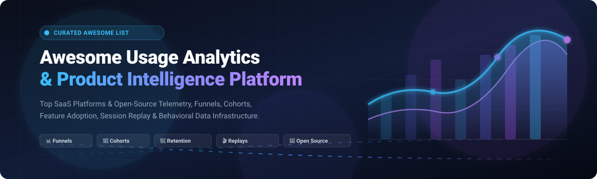

<p align="center">
  
</p>

# 🚀 Awesome Usage Analytics & Product Intelligence Platform

<p align="center">
  <a href="https://github.com/ishandutta2007/Awesome-Awesome-Awesome"></a>
  <a href="https://discord.gg/jc4xtF58Ve"></a>
  <a href="https://github.com/ishandutta2007/Awesome-Usage-Analytics-Platform/stargazers"></a>
  <a href="https://github.com/ishandutta2007/Awesome-Usage-Analytics-Platform/network/members"></a>
  <a href="https://github.com/ishandutta2007/Awesome-Usage-Analytics-Platform/blob/main/LICENSE"></a>
  <a href="https://github.com/ishandutta2007/Awesome-Usage-Analytics-Platform/pulls"></a>
  <a href="https://github.com/ishandutta2007"></a>
</p>

---

## 🌟 Overview & Ecosystem

A definitive, SEO-optimized curated directory of **SaaS Products** and **Open-Source GitHub Projects** for **Product Analytics, User Behavior Analytics, Feature Adoption, Customer Journey Tracking, Funnel Analysis, Retention & Cohort Intelligence, Session Replays, and Product-Led Growth (PLG)**.

> 🔍 **Keywords / Topics**: `product-analytics`, `usage-analytics`, `user-behavior`, `behavioral-analytics`, `feature-adoption`, `funnel-analysis`, `retention-analysis`, `cohort-analysis`, `session-replay`, `event-tracking`, `customer-journey`, `product-led-growth`, `open-source-analytics`, `telemetry`.

Modern usage analytics transforms raw application events into actionable growth drivers:
$$\text{User} \longrightarrow \text{Session} \longrightarrow \text{Event} \longrightarrow \text{Feature} \longrightarrow \text{Journey} \longrightarrow \text{Cohort} \longrightarrow \text{Conversion} \longrightarrow \text{Revenue}$$

---

## 📑 Table of Contents

- [🏢 SaaS & Hosted Platforms](#-saas--hosted-platforms)
- [💻 Open-Source GitHub Projects](#-open-source-github-projects)
- [🏗️ Event Tracking & Analytics Architecture](#️-event-tracking--analytics-architecture)
- [🔄 Product Analytics End-to-End Workflow](#-product-analytics-end-to-end-workflow)
- [📊 Feature Adoption Intelligence Layer](#-feature-adoption-intelligence-layer)
- [🎯 Funnel & Conversion Analytics](#-funnel--conversion-analytics)
- [🔁 Retention & Cohort Analytics](#-retention--cohort-analytics)
- [📈 Product-Led Growth (PLG) Signals](#-product-led-growth-plg-signals)
- [🤖 AI-Assisted Analytics Architecture](#-ai-assisted-analytics-architecture)
- [📈 Star History](#-star-history)
- [🤝 How to Contribute](#-how-to-contribute)
- [📜 Disclaimer & License](#-disclaimer--license)

---

## 🏢 SaaS & Hosted Platforms

*Ranked and sorted by company size, market valuation, and estimated annual revenue (descending).*

| 🏷️ Platform | 💰 Valuation / Company Size | 🎯 Primary Focus & Description | 💳 Starting Tier Pricing | 🎁 Free Tier / Trial Limits |
| :--- | :--- | :--- | :--- | :--- |
| **[Firebase Analytics](https://firebase.google.com/products/analytics)** | **~$2.1 Trillion** (Alphabet Inc. Parent) / $300B+ Ann. Rev | Google Analytics-powered mobile & web app telemetry, user segmentation, crash diagnostics, and GCP integration. | **$0** (Free on Spark tier; pay-as-you-go Blaze plan for external Google Cloud services) | **Free forever** with unlimited event volume and unlimited users (up to 500 distinct custom events) |
| **[Pendo](https://www.pendo.io/)** | **~$2.6 Billion** Valuation / ~$150M+ ARR | Product experience platform combining usage telemetry, feature adoption tracking, in-app guides, and NPS feedback. | Starts at **~$583/mo** ($7,000/yr billed annually, Base plan) | **Free forever plan** up to 500 Monthly Active Users (MAUs), basic guides & NPS surveys |
| **[FullStory](https://www.fullstory.com/)** | **~$1.8 Billion** Valuation / ~$100M+ ARR | Behavioral data platform providing high-fidelity session replays, frustration signals (rage clicks), and funnel drop-off analytics. | Starts at **~$833/mo** (~$10,000/yr billed annually, Business tier) | **Free forever plan** (FullstoryFree) up to 30,000 sessions/month & 5,000 server events/mo, or **14-day free trial** (Business edition, up to 5,000 sessions) |
| **[Amplitude](https://amplitude.com/)** | **~$1.4 Billion** Market Cap (NASDAQ: AMPL) / ~$290M+ ARR | Enterprise product intelligence and behavioral analytics platform offering advanced cohort analysis, funnels, and event tracking. | Starts at **$49/mo** (Plus plan, monthly/annual billing) | **Free forever plan** (Starter tier) up to 2,000,000 events/month, unlimited seats & core analytics |
| **[Gainsight PX](https://www.gainsight.com/product-experience/)** | **~$1.1 Billion** Valuation (Vista Equity Partners) / ~$150M+ ARR | Comprehensive product experience and PLG platform tracking product telemetry, user health scores, and personalized in-app engagements. | Starts at **~$1,500/mo** (SMB/Enterprise entry tier) | **15-day free trial** (guided POC); Free starter tier up to 100 MAUs |
| **[Mixpanel](https://mixpanel.com/)** | **~$1.05 Billion** Valuation / ~$100M+ ARR | Event-based product analytics platform for exploring funnels, retention curves, user flows, multi-touch attribution, and conversion metrics. | Starts at **$20/mo** (Growth plan, usage-based scaling) | **Free forever plan** up to 1,000,000 events/month, 10,000 session replays/month, 5 saved reports per seat |
| **[Heap](https://www.heap.io/)** | **~$500 Million** Valuation (Contentsquare Group, $5.6B) / ~$60M+ ARR | Digital insights platform featuring automatic event capture (autocapture), retroactive funnel definition, and user journey maps. | Starts at **~$300/mo** ($3,600/yr billed annually, Growth plan) | **Free forever plan** up to 10,000 sessions/month, 6 months data history, 1 project |
| **[Indicative](https://www.indicative.com/)** | **~$450 Million** Valuation (mParticle) / ~$50M+ ARR | Customer journey analytics engine connecting marketing touchpoints with multi-path product event funnels (by mParticle). | Starts at **$950/mo** (Pro plan) | **Free forever plan** up to 25,000,000 events/month, 3 seats, 6 months data retention |
| **[LogRocket](https://logrocket.com/)** | **~$300 Million** Valuation / ~$30M+ ARR | Frontend application monitoring, session replay, performance metrics, and product analytics diagnosing UX friction and errors. | Starts at **$69/mo** (Team plan) / **$295/mo** (Professional plan) | **Free forever plan** up to 1,000 sessions/month, 1 month data retention |
| **[PostHog Cloud](https://posthog.com/)** | **~$200 Million** Valuation / ~$20M+ ARR | All-in-one product suite featuring product analytics, session replay, feature flags, A/B testing, surveys, and built-in data warehouse. | Starts at **$0/mo base** (Pay-as-you-go above free tier; Boost tier at $250/mo) | **Free forever plan** up to 1,000,000 events/mo, 5,000 session recordings/mo, 1M feature flags, 100k error exceptions/mo |
| **[Userpilot](https://userpilot.com/)** | **~$70 Million** Valuation / ~$10M+ ARR | In-app user engagement, feature adoption tracking, product tours, onboarding flows, user surveys, and behavioral analytics. | Starts at **$299/mo** (Starter plan, billed annually) | **14-day free trial** with full platform access up to 2,000 MAUs (no credit card required) |
| **[June](https://www.june.so/)** | **~$30 Million** Valuation / ~$3M+ ARR | B2B SaaS product analytics with ready-made metrics (active users, power users, retention, feature usage) and CRM/Slack integrations. | Starts at **$149/mo** (Growth plan; $119/mo billed annually) | **Free forever plan** up to 1,000 Monthly Active Users (MAUs), unlimited seats & 15+ templates |

---

## 💻 Open-Source GitHub Projects

*Ranked and sorted by GitHub Star count (descending). Each repo features a live social star badge linking directly to its GitHub stargazers.*

| 📦 Repository & Stars | 🛠️ Tech Stack | 📋 Description & Primary Focus | ⚖️ License |
| :--- | :--- | :--- | :--- |
| **[Umami](https://github.com/umami-software/umami)** [](https://github.com/umami-software/umami/stargazers) | Node.js, Next.js, PostgreSQL/MySQL | Privacy-focused, lightweight open-source analytics platform. Clean alternative to Google Analytics with cohort and user journey tracking. | MIT |
| **[PostHog](https://github.com/PostHog/posthog)** [](https://github.com/PostHog/posthog/stargazers) | Python, Django, TypeScript, ClickHouse | Complete open-source product intelligence suite: event analytics, session replay, feature flags, A/B testing, surveys, and data warehouse. | MIT / PostHog EE |
| **[Plausible](https://github.com/plausible/analytics)** [](https://github.com/plausible/analytics/stargazers) | Elixir, Phoenix, ClickHouse, PostgreSQL | Lightweight (< 1 KB script), cookie-free, privacy-first web telemetry and usage analytics platform. | AGPL-3.0 |
| **[Matomo](https://github.com/matomo-org/matomo)** [](https://github.com/matomo-org/matomo/stargazers) | PHP, MySQL / MariaDB | Leading decentralized web and mobile analytics platform offering 100% data ownership, heatmaps, funnels, and GDPR compliance. | GPL-3.0 |
| **[GoAccess](https://github.com/allinurl/goaccess)** [](https://github.com/allinurl/goaccess/stargazers) | C, ncurses | Fast, real-time web log analyzer and interactive dashboard viewer that runs in a terminal or web browser. | MIT |
| **[OpenReplay](https://github.com/openreplay/openreplay)** [](https://github.com/openreplay/openreplay/stargazers) | Go, TypeScript, Rust, ClickHouse | Developer-focused self-hosted session replay, cobrowsing, and product telemetry suite with network performance inspection. | Fair Source |
| **[GrowthBook](https://github.com/growthbook/growthbook)** [](https://github.com/growthbook/growthbook/stargazers) | TypeScript, Node.js, Next.js, Python | Open-source experimentation, feature flagging, and statistical A/B testing analytics connected directly to your data warehouse. | MIT |
| **[Fathom Lite](https://github.com/usefathom/fathom)** [](https://github.com/usefathom/fathom/stargazers) | Go, Preact | Simple, privacy-oriented website analytics software built as a single Go binary. | MIT |
| **[Snowplow](https://github.com/snowplow/snowplow)** [](https://github.com/snowplow/snowplow/stargazers) | Scala, Java, Kafka, Snowflake, BigQuery | Enterprise-grade behavioral data pipeline engine for generating, validating, enriching, and modeling event streams in real time. | Snowplow Limited Use |
| **[Flagsmith](https://github.com/Flagsmith/flagsmith)** [](https://github.com/Flagsmith/flagsmith/stargazers) | Python, Django, React, PostgreSQL | Open-source feature flagging, remote configuration, and user segmentation analytics service. | BSD-3-Clause |
| **[GoatCounter](https://github.com/arp242/goatcounter)** [](https://github.com/arp242/goatcounter/stargazers) | Go, SQLite / PostgreSQL | Easy, privacy-respecting web analytics tool without personal data tracking or cookie consent banners. | EUPL-1.2 |
| **[Countly](https://github.com/Countly/countly-server)** [](https://github.com/Countly/countly-server/stargazers) | Node.js, MongoDB | Real-time product and mobile usage analytics platform with user profiles, push notifications, and crash analytics. | AGPL-3.0 |
| **[Jitsu](https://github.com/jitsucom/jitsu)** [](https://github.com/jitsucom/jitsu/stargazers) | TypeScript, Go, ClickHouse, Redis | Open-source data ingestion engine and Segment alternative for collecting, transforming, and routing product telemetry events. | MIT |
| **[Ackee](https://github.com/electerious/Ackee)** [](https://github.com/electerious/Ackee/stargazers) | Node.js, GraphQL, MongoDB | Self-hosted, privacy-first Node.js analytics dashboard focused on minimalist tracking. | MIT |
| **[RudderStack](https://github.com/rudderlabs/rudder-server)** [](https://github.com/rudderlabs/rudder-server/stargazers) | Go, Node.js, PostgreSQL | Customer data infrastructure (CDI) platform for collecting and routing event data to analytics destinations and warehouses. | SSPL |
| **[Shynet](https://github.com/milesmcc/shynet)** [](https://github.com/milesmcc/shynet/stargazers) | Python, Django, PostgreSQL | Modern, privacy-friendly, cookie-free web telemetry analytics engine requiring zero JavaScript on client side. | Apache-2.0 |
| **[Open Web Analytics](https://github.com/Open-Web-Analytics/Open-Web-Analytics)** [](https://github.com/Open-Web-Analytics/Open-Web-Analytics/stargazers) | PHP, JavaScript, MySQL | Open-source framework providing web tracking, mouse click heatmaps, keystroke analytics, and goal funnels. | GPL-2.0 |
| **[Aptabase](https://github.com/aptabase/aptabase)** [](https://github.com/aptabase/aptabase/stargazers) | Rust, ClickHouse, Svelte | Privacy-first, open-source crash reporting and usage analytics engine for mobile, desktop, and web applications. | AGPL-3.0 |
| **[Swetrix](https://github.com/Swetrix/swetrix)** [](https://github.com/Swetrix/swetrix/stargazers) | TypeScript, Express, ClickHouse, Redis | Fully open-source, cookieless web telemetry and custom event analytics platform with performance monitors. | AGPL-3.0 |

---

## 🏗️ Event Tracking & Analytics Architecture

```
                         ┌──────────────────────────────┐
                         │   📱 Web / Mobile / API App  │
                         └──────────────┬───────────────┘
                                        │
                               Event SDK / Telemetry
                                        │
                         ┌──────────────▼───────────────┐
                         │     📡 Event Ingestion       │
                         │    Snowplow / RudderStack    │
                         │    Jitsu / PostHog SDKs      │
                         └──────────────┬───────────────┘
                                        │
                         ┌──────────────▼───────────────┐
                         │   ⚙️ Processing & Validation  │
                         │  Schema Check & Enrichment   │
                         └──────────────┬───────────────┘
                                        │
              ┌─────────────────────────┼─────────────────────────┐
              │                         │                         │
        ┌─────▼─────────────┐     ┌─────▼─────────────┐     ┌─────▼─────────────┐
        │  ⚡ ClickHouse /   │     │  🐘 PostgreSQL /  │     │  ❄️ Data Lake /   │
        │     Pinot (OLAP)  │     │     DuckDB        │     │     Warehouse     │
        └─────┬─────────────┘     └─────┬─────────────┘     └───────────────────┘
              │                         │
              └────────────┬────────────┘
                           │
                 ┌─────────▼──────────────┐
                 │  📊 Behavioral Layer   │
                 │ Funnels, Cohorts, Flow │
                 │ Retention & Heatmaps   │
                 └─────────┬──────────────┘
                           │
                 ┌─────────▼──────────────┐
                 │  📈 Dashboards & BI    │
                 │ Grafana, Superset, BI  │
                 │ Metabase & Custom UIs  │
                 └────────────────────────┘
```

---

## 🔄 Product Analytics End-to-End Workflow

```
   [ Application Event ] ──► ( validation & schema verification )
            │
            ▼
   [ User Identification ] ──► ( Anonymous ID ──► Identified User ID )
            │
            ▼
   [ Event Enrichment ] ──► ( Device, GeoIP, Account, Version, Feature Tag )
            │
            ▼
   [ Columnar Storage (ClickHouse/OLAP) ]
            │
            ▼
   [ Sessionization & Behavioral Modeling ]
            ├──► 🎯 Funnel Drop-off Analysis
            ├──► 🔁 Retention & Cohort Decay Curves
            ├──► 🗺️ User Journey Paths & Sankey Flow
            └──► 🎬 Session Replay Reconstruction
            │
            ▼
   [ Product Actionable Insight ] ──► [ Experiment / Feature Update ] ──► [ Measure Impact ]
```

---

## 📊 Feature Adoption Intelligence Layer

A robust usage analytics platform separates vanity pageviews from genuine feature adoption:

$$\text{Feature Adoption Rate} = \frac{\text{Unique Active Users Performing Feature Action}}{\text{Total Eligible Active Users in Cohort}} \times 100\%$$

```
Feature Adoption Funnel:
├── 👁️ Feature Awareness    (User sees feature element or UI badge)
├── ⚡ Feature Activation   (User clicks and completes first feature interaction)
├── 🔁 Feature Adoption     (User repeats key feature interaction >= 3 times in 7 days)
├── 🏆 Feature Engagement   (Feature becomes integral part of weekly workflow)
├── 🛡️ Feature Retention    (User continues feature usage at Day 30 / Day 90)
└── ⚠️ Feature Churn Risk   (Usage drops > 50% relative to historical baseline)
```

---

## 🎯 Funnel & Conversion Analytics

```
Landing Page Event ──► [ signup_started ]
          │
          ▼
Account Created   ──► [ user_registered ]
          │
          ▼
Onboarding Step   ──► [ onboarding_step_completed ]
          │
          ▼
Core Value Action ──► [ first_key_feature_used ] (⚡ Activation Point)
          │
          ▼
Trial / Upgrade   ──► [ subscription_activated ] (💰 Conversion)
          │
          ▼
30-Day Activity   ──► [ retained_active_user ] (🔁 Retained Customer)
```

Key metrics calculated at each funnel stage:
- **Conversion Rate ($CR$)**: Percentage of step entrants progressing to next step.
- **Drop-off Velocity**: Time elapsed before drop-off occurs.
- **Cohort Attribution**: Performance segmented by marketing channel, user role, and browser/OS.

---

## 🔁 Retention & Cohort Analytics

```
 Cohort Anchor
       │
       ├─► Day 0: 100% (First Value Event)
       ├─► Day 1:  68%
       ├─► Day 7:  49%
       ├─► Day 14: 38%
       ├─► Day 30: 31% (Retention Baseline)
       ├─► Day 60: 28%
       └─► Day 90: 27% (Sticky Product Plateau)
```

**Key Cohort Segmentation Dimensions**:
- **Signup Date / Month**
- **Acquisition Channel** (Organic, Product-led, Paid, Referral)
- **Subscription Tier** (Free, Starter, Pro, Enterprise)
- **Role & Company Size**
- **Feature Activation Milestone** (Users who used Feature X vs. Did Not)

---

## 📈 Product-Led Growth (PLG) Signals

```
 [ Product Telemetry ] ──► [ Real-time Scoring Engine ] ──► [ Automated Actions ]
           │
           ├── 🚀 Expansion Signal: WAU / MAU ratio > 60%, 80%+ seat utilization
           ├── 🔔 PQL (Product Qualified Lead): Hit 85% of free tier limits in < 7 days
           ├── ⚠️ Churn Alarm: 0 active events logged in past 14 consecutive days
           └── 💼 Enterprise Signal: Multiple team invites from same corporate domain
```

---

## 🤖 AI-Assisted Analytics Architecture

```
 ┌──────────────────────┐      ┌─────────────────────────┐
 │ Product Telemetry    │ ───► │ ClickHouse / Warehouse  │
 └──────────────────────┘      └────────────┬────────────┘
                                            │
                               ┌────────────▼────────────┐
                               │ Semantic & Metric Layer │
                               └────────────┬────────────┘
                                            │
                               ┌────────────▼────────────┐
                               │ 🤖 AI Analytics Agent    │
                               └────────────┬────────────┘
              ┌─────────────────────────────┼─────────────────────────────┐
              │                             │                             │
    ┌─────────▼───────────────┐   ┌─────────▼───────────────┐   ┌─────────▼───────────────┐
    │ 🗣️ Natural Language     │   │ 🚨 Automated Anomaly    │   │ 📉 Root-Cause           │
    │     SQL Queries         │   │     Detection Alerts    │   │     Drop-off Diagnosis  │
    └─────────────────────────┘   └─────────────────────────┘   └─────────────────────────┘
```

---

## 📈 Star History

[](https://star-history.dera.page/#ishandutta2007/Awesome-Usage-Analytics-Platform&type=date&legend=top-left)

---

## 🤝 How to Contribute

Contributions are warmly welcomed! Please follow these guidelines:

1. 🍴 **Fork the repository**.
2. 🌿 **Create a feature branch** (`git checkout -b add-analytics-platform`).
3. 📝 **Add/Update the platform entry**:
   - Ensure SaaS entries include **Starting Pricing**, **Valuation / Size**, and specific **Free Tier Limits**.
   - Ensure Open-Source entries include a **Social Star Badge**, **Tech Stack**, and link to GitHub.
4. ✅ **Verify links and markdown formatting**.
5. 🚀 **Submit a Pull Request** with a descriptive summary of changes.

---

## 📜 Disclaimer & License

- **Disclaimer**: This list is community-curated for informational purposes. Product analytics, web analytics, session replay, and customer data infrastructure are complementary but distinct domains. Always verify licensing, privacy policies, GDPR/HIPAA compliance, and security postures before deploying.
- **License**: Released under the [MIT License](LICENSE).

---

<p align="center">
  <b>Built with ❤️ for Product Managers, Engineers, Growth Hackers, and Data Teams.</b><br/>
  <sub>Let's make usage analytics open, privacy-conscious, self-hostable, and data-driven.</sub>
</p>
